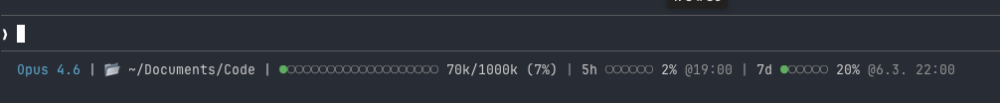

# Claude Code Status Line

Erweiterte Statuszeile für Claude Code mit Kontext-Anzeige, Git-Info und API-Usage-Limits.



## Anzeige

```
Opus 4.6 | 📂 …/Code/Projekt | ●●○○○○○○○○○○○○○○○○○○ 24k/200k (12%) | ⎇ main ✓ | 5h ○○○○○○ 2% @19:00 | 7d ●○○○○○ 20% @6.3. 22:00
```

### Segmente

| Segment | Beschreibung |
|---------|-------------|
| **Modell** | Aktuelles Claude-Modell (z.B. Opus 4.6) |
| **Verzeichnis** | Aktuelles Arbeitsverzeichnis (gekürzt) |
| **Context** | Fortschrittsbalken + Token-Verbrauch (20 Punkte breit) |
| **Git** | Branch + Anzahl geänderter Dateien |
| **5h-Limit** | 5-Stunden-Nutzungslimit mit Reset-Uhrzeit |
| **7d-Limit** | 7-Tage-Nutzungslimit mit Reset-Datum |

### Farbcodierung (Fortschrittsbalken)

- **Grün** (<50%) — alles entspannt
- **Blau/Accent** (50-69%) — wird voller
- **Gelb** (70-89%) — Achtung
- **Rot** (90%+) — kritisch

## Voraussetzungen

- `jq` — JSON-Verarbeitung
- `curl` — API-Aufrufe
- `xxd` — Keychain-Dekodierung (macOS)
- Claude Code mit OAuth-Login (für Usage-Daten)

## Installation

In `~/.claude/settings.json`:

```json
{
  "statusLine": {
    "type": "command",
    "command": "~/.claude/scripts/statusline/statusline.sh"
  }
}
```

## Konfiguration

### Farbthema

Zeile 5 im Skript ändern:

```bash
COLOR="blue"  # gray, orange, blue, teal, green, lavender, rose, gold, slate, cyan
```

### Kompatibilität

- GNU coreutils (`stat -c`, `date -d`) mit BSD-Fallback
- macOS Keychain (hex-kodierter Blob) + `CLAUDE_CODE_OAUTH_TOKEN` Env-Variable
- Usage-Daten werden 60 Sekunden in `/tmp/claude/statusline-usage-cache.json` gecacht

## Inspiration

Basierend auf [daniel3303/ClaudeCodeStatusLine](https://github.com/daniel3303/ClaudeCodeStatusLine).
